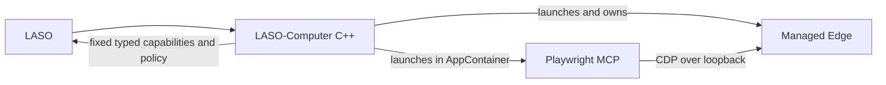

# Playwright provider investigation (2026-09-29)

## Current outcome: attached, first operation blocked by path metadata

The pinned MCP release supports connecting to a C++-owned Chromium browser through CDP. C++ launches Edge under its own Job Object. MCP initializes, lists its fixed tools, and the real `browser_tabs` probe attaches to that Edge after a temporary provider-SID loopback exemption and a local Playwright named-pipe namespace adjustment. The first actual browser operation still fails with `EPERM` during Node `realpath`; no navigation or page operation completes. The adapter is not ready for use.

Test system: Windows 11 x64, MSVC/VS 2022, Node.js 24.21.0 x64, `@playwright/mcp` 0.0.83, bundled Playwright `1.64.0-alpha-1790635538000`, Microsoft Edge 154.0.4258.37 / Chromium 154.0.8037.58.

## Process and containment model



The C++ runtime creates a unique `%LOCALAPPDATA%\\LASO-Computer\\browser-runs\\<run-id>` directory and profile, chooses an unused loopback port, then starts the administrator-configured Edge executable directly with a fixed argument set. Edge receives an explicit managed `--user-data-dir`; its normal profile is never selected. `--no-sandbox` is not used. Edge's process tree is assigned to a kill-on-close Job Object with an active-process cap and memory limit. The configured executable path is checked for absolute, existing, non-reparse components before launch.

The runtime waits for `/json/version`, checks the Edge identity and WebSocket URL, confirms the `DevToolsActivePort` listener is exactly `127.0.0.1`, and confirms the listener PID is the Edge process handle it launched. It then starts MCP with `browser.cdpEndpoint` and `cdpTimeout` in a generated provider config. MCP runs with a sanitized environment, explicit stdio handles, a Job Object limited to one active process (so it cannot create Edge or another child), and an AppContainer with no network capabilities. Provider shutdown precedes Edge shutdown; both job trees and the per-run profile/temp directories are reclaimed.

The Node main-module volume-root `lstat('C:\\')` probe is avoided by `--preserve-symlinks-main`; no volume-root ACL has been applied. The provider temp/output path is under the AppContainer's own `AC\\ms-playwright\\LASO-Computer\\plugin-temp` tree. Do not override `LOCALAPPDATA` with the `AC` root: Playwright's server registry appends its own `ms-playwright\\b` path, producing a duplicated `AC\\Packages\\...\\AC` path. The process receives the normal host `LOCALAPPDATA` value and an explicit managed `PLAYWRIGHT_BROWSERS_PATH`.

## Pin and CDP support verification

The installed exact `@playwright/mcp` 0.0.83 package documents `browser.cdpEndpoint`, `browser.cdpHeaders`, and `browser.cdpTimeout` in its shipped `config.d.ts`; its shipped README documents `--cdp-endpoint`. The pinned bundled `playwright-core` implements `chromium.connectOverCDP`. The provider version and lockfile were not changed.

Edge was tested with `--remote-debugging-address=127.0.0.1` and a port dynamically selected by binding a Winsock socket to loopback port 0, reading the assigned port, and closing the reservation immediately before launch. On this Windows 11 host the listener appeared only on `127.0.0.1`, and `/json/version` reported Edge 154.0.4258.37. The process owning that listener matched the process C++ launched. CDP does not provide endpoint authentication for this configuration; a same-user local process that discovers the short-lived port can connect. The random port and per-run profile protect against accidental reuse, not a compromised same-user process. The endpoint is not logged or returned to LASO.

## Exact remaining blocker

The `LASOComputer.Playwright` AppContainer has no network capabilities. A temporary SID-specific loopback exemption allowed the MCP provider to connect to the C++-owned Edge on loopback; this exemption grants that AppContainer local loopback access generally, not just access to the chosen port. It is a test-only machine setting and must be removed after testing.

```text
Error: EPERM: operation not permitted, realpath '<managed AppContainer output directory>'
```

Temporary Node instrumentation confirmed both emulated and native `realpath` fail because AppContainer `lstat` is denied for each absolute-path ancestor, including the volume root. The provider SID currently has traverse permission on the profile path but not `FILE_READ_ATTRIBUTES`. Validation of `FILE_READ_ATTRIBUTES | FILE_TRAVERSE` on only the exact ancestor directories is pending administrator UAC approval. No directory listing or file-data access is required by the observed error. No broad `C:\` read permission is acceptable. Until a least-privilege path check and full browser fixture pass, the browser integration remains blocked.

The package's Windows named-pipe helper also required a local adjustment from `\\.\\pipe\\pw-...` to `\\.\\pipe\\LOCAL\\pw-...` for AppContainer startup. `plugins/playwright/patch-appcontainer-pipes.cjs` now applies this only to the pinned MCP/core versions and is wired as an npm `postinstall`. Its exact replacement and idempotence were tested against a staged copy of the installed bundle. A full `npm ci` from a clean checkout was not run because npm is not installed on this host; npm lifecycle execution and clean-install provisioning remain unverified.

The Edge CDP listener itself is loopback-only, but CDP has no authentication. Local same-user processes remain a residual hijack risk. This is not protection against a compromised Windows account or administrator.

## Fixed operation surface

The adapter maps only named, typed browser operations to the pinned MCP tools: navigate, snapshot, text query, click by snapshot reference, fill, select, tabs, back, and screenshot. The endpoint policy is evaluated before every call. Arbitrary JavaScript/Playwright code, arbitrary MCP tool passthrough, shell, filesystem tools, cookies/storage, upload, and download are not exposed. Since the startup probe currently fails, none of those browser operations has passed through LASO-Computer.

## Validation matrix

| Check | Result |
| --- | --- |
| Pinned MCP 0.0.83 CDP config/source inspection | PASS |
| Debug C++ build | PASS |
| Debug CTest | PASS (1/1) |
| C++ Edge launch, explicit unique profile, listener PID/loopback verification | PASS |
| Edge external-network navigation or local fixture | NOT RUN through MCP |
| MCP initialize and fixed tool list | PASS |
| AppContainer-specific loopback exemption and MCP → Edge attach | PASS for this temporary test |
| MCP initialize/version, fixed tool list, and `browser_tabs` startup probe | PASS after local named-pipe patch |
| Browser navigation/snapshot/click/fill/select/tabs/screenshot | BLOCKED at first call (`EPERM realpath`) |
| AppContainer outside-file/process denial under final configuration | NOT RUN |
| Provider/browser crash, operation timeout/cancellation/restart | NOT RUN end-to-end |
| Read-attributes/traverse ancestor ACL test and restoration | PENDING UAC |
| Exact-version guarded pipe-patch script and idempotence | PASS against staged bundle copy |
| Clean `npm ci` / postinstall from checkout | NOT RUN (npm unavailable) |
| Loopback exemption cleanup | PENDING after tests |
| Broad `C:\\` access or `--no-sandbox` | NOT used |

Issue #2 must remain open until a scoped loopback strategy is proven and the browser-operation, policy-deny, sandbox-deny, lifecycle, Debug, and Release acceptance tests pass. See the issue for the current public blocker.
