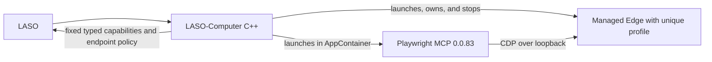

# Playwright provider

## Windows implementation and current status

LASO-Computer C++ launches and owns an isolated Edge process. It then starts the pinned Playwright MCP provider in a Windows AppContainer and connects that provider to the Edge instance over CDP on loopback. MCP does not launch or select a browser. Browser capabilities are exposed only through the C++ endpoint policy and a fixed typed adapter.



Tested locally on Windows 11 x64 with MSVC/Visual Studio 2022, Node.js 24.21.0 x64, `@playwright/mcp` 0.0.83, its bundled Playwright `1.64.0-alpha-1790635538000`, and Microsoft Edge 154.0.4258.37 / Chromium 154.0.8037.58. Node 22.23.3 reproduced the same original AppContainer `realpath` failure; the final browser fixture has so far been run with Node 24.21.0.

## Root cause and chosen workaround

The first real MCP browser operation generated a snapshot under the provider's AppContainer-owned output directory:

```text
%LOCALAPPDATA%\Packages\<app-container>\AC\ms-playwright\LASO-Computer\plugin-temp\<run-id>\...
```

Node reported `EPERM` from `fs.realpath`. A local native Win32 probe showed that opening the path with `CreateFileW` succeeds, but `GetFinalPathNameByHandleW(..., VOLUME_NAME_DOS)` returns `ERROR_ACCESS_DENIED` (5). The same handle succeeds with the NT or volume-less name modes. This is Windows AppContainer volume-name resolution behavior, not denial of file data access. Node 22 and 24 behaved the same way. Explicit non-inheriting `FILE_TRAVERSE`, `FILE_READ_ATTRIBUTES`, and combined ACE experiments on exact ancestors did not fix it; the ACLs were restored. No permission was added to `C:\` or its descendants.

The implementation uses the documented `@playwright/mcp` 0.0.83 `--allow-unrestricted-file-access` option so MCP skips its own workspace-root and `file://` guard that depends on the failing canonicalization. That option weakens MCP's own guardrail. The endpoint therefore relies on the OS AppContainer ACLs and Job Object for provider containment, plus the C++ capability boundary: C++ accepts only HTTP(S) in `browser.navigate`, exposes no MCP filesystem or arbitrary-tool passthrough, and maps only fixed browser tools. Do not remove the AppContainer, its narrow ACLs, or the one-process Job Object. Do not compensate with a broad filesystem ACE.

This is a documented upstream workaround, not a fix to Node's realpath behavior. Microsoft's [STL issue #6286](https://github.com/microsoft/STL/issues/6286) describes the same AppContainer failure in `GetFinalPathNameByHandleW` DOS-volume translation; a direct local probe confirmed the corresponding Win32 behavior here. `libuv`'s Windows `realpath` path uses the DOS-volume mode ([source](https://github.com/libuv/libuv/blob/v1.x/src/win/fs.c)).

Containment checks were performed from the actual provider process with generated test material outside the provider runtime:

- Reading a generated `C:\Users\Public` test file: denied (`EPERM`).
- Writing a sibling generated file there: denied (`EPERM`).
- Spawning `whoami.exe` from Node: denied (`UNKNOWN` from Node's `spawn`), consistent with the provider Job Object's one-active-process limit.
- Direct `browser.navigate` to `file://`: rejected by the C++ URL validator.
- Clicking an HTTP fixture link to the generated `file://` test file: Edge 154 remained on the HTTP fixture; subsequent snapshot contained no test marker.

These checks do not claim protection from another process running as the same Windows user, an administrator, or a compromised Edge/browser sandbox. The flag disables an MCP guardrail, so changes to the tool list or capability mapping require renewed security review.

## Process ownership and profile

The C++ runtime creates a unique `%LOCALAPPDATA%\LASO-Computer\browser-runs\<run-id>` directory and `--user-data-dir`, chooses an ephemeral loopback port, and launches the administrator-configured Edge executable directly with fixed arguments. It never selects the user's normal Edge profile, cookies, password store, extensions, or history. Edge's own Chromium sandbox remains enabled; `--no-sandbox` is not used. A kill-on-close Job Object owns Edge's process tree and limits process count and memory. The executable must be an absolute existing path with non-reparse components.

The runtime checks `/json/version`, the browser identity, `DevToolsActivePort`, loopback binding, and that the listener PID matches the launched Edge process. CDP uses HTTP/WebSocket on `127.0.0.1` with a dynamically selected port. This Edge configuration has no CDP authentication. Another process under the same user could discover and connect to the short-lived port; the endpoint is not logged or returned to LASO. This residual local-user risk is documented, not eliminated by the random port.

The provider receives only the necessary environment, explicit stdio handles, an AppContainer SID, and no AppContainer network capabilities. Its Job Object allows one process, so MCP cannot launch Edge or arbitrary helper processes. Edge itself performs website DNS/TLS/network traffic. Since MCP must make a local TCP connection to Edge's CDP endpoint, this configuration requires that the AppContainer be allowed to use loopback. A session that has no loopback exemption cannot attach; the broker currently offers query and legacy-cleanup only, not exemption provisioning.

## Capability boundary

The C++ adapter invokes explicit MCP tool names only: navigate, snapshot, text query, click by snapshot reference, fill, select, tabs, back, and screenshot. The endpoint policy is checked before each action. MCP's own tools are never passed through by name. The endpoint does not expose arbitrary JavaScript/Playwright execution, shell, file access, cookies/storage, upload, or download capabilities. A provider being installed or healthy does not allow a capability that endpoint policy denies.

## Local validation

The actual C++ → AppContainer MCP → CDP → C++-owned Edge path passed a deterministic local fixture in both clean Debug and Release builds for provider startup, navigation, structured snapshot, fill, click, resulting DOM state, select, tab listing, screenshot, and link navigation. A separate public HTTPS check navigated to `https://example.com/` and verified the structured snapshot. Direct `file://` navigation was rejected by C++; in a separate test, clicking an HTTP fixture link to a generated public test file did not navigate Edge to the file or expose its marker. With a generated outside file, Node's read and write attempts were denied (`EPERM`), and its attempt to spawn `whoami.exe` failed under the one-process Job Object.

On 2026-09-30, a clean Debug reproduction with the temporary exemption absent reached MCP initialization and tool listing, then failed on the first `browser_tabs` probe. A local-only diagnostic captured Playwright's full error: `connect ETIMEDOUT 127.0.0.1:<dynamic-port>` while retrieving the websocket URL from the HTTP CDP endpoint. Before launching MCP, C++ had parsed `DevToolsActivePort`, fetched `/json/version`, validated Edge's browser websocket path, and confirmed the loopback listener belonged to its Edge process. MCP 0.0.83's configured form is correctly `http://127.0.0.1:<port>`; the error call log shows it using that HTTP endpoint to retrieve the websocket URL.

To separate CDP/startup behavior from AppContainer network isolation, a temporary local diagnostic build omitted only the AppContainer attribute. With the same C++-owned Edge lifecycle, `--remote-debugging-port=0`, generated `DevToolsActivePort`, endpoint construction, MCP 0.0.83 package, and current Edge Job Object limits, the complete fixture passed: navigate, snapshot, fill/click state change, select, tabs, screenshot, and link navigation. The temporary bypass was reverted before publication and is not a supported configuration. `CheckNetIsolation LoopbackExempt -s` showed an empty exemption list. The MCP AppContainer is created with no network capabilities. Microsoft's Windows guidance states that loopback between a sandboxed/packaged process and an unpackaged local process is blocked by default and requires loopback enablement ([Windows Firewall troubleshooting](https://learn.microsoft.com/en-us/windows/security/operating-system-security/network-security/windows-firewall/troubleshooting-uwp-firewall), [NetworkIsolationSetAppContainerConfig](https://learn.microsoft.com/en-us/windows/win32/api/networkisolation/nf-networkisolation-networkisolationsetappcontainerconfig)).

This evidence rules out the `--remote-debugging-port=0`/`DevToolsActivePort` endpoint form and the current Edge/MCP Job Object limits as the cause. It identifies the current blocker as AppContainer-to-loopback network isolation after the exemption was removed. The earlier browser PASS was run while the prior exemption state was in place; it did not prove attachment works without it. No UAC was requested and no exemption was recreated in this investigation. Production AppContainer containment remains enabled and browser capabilities fail closed without an authorized loopback path. Hosted CI browser validation is not part of the current lane.

## Reproduction and cleanup notes

The package version is checked at startup and pinned to 0.0.83; production configuration must not use `@latest`. Provider dependencies are provisioned beneath the administrator-managed LASO-Computer runtime. Browser profiles and per-run MCP output are unique and removed during normal shutdown. Clean-install provisioning is documented in the repository. Loopback exemption state is machine-wide; no exemption is currently present. Enabling loopback is a privileged provisioning choice and remains unimplemented in this session; do not add one without an attended authorization and an explicit security review.

The current no-exemption attachment failure, residual same-user CDP risk, and limits of Edge's `file://` blocking remain explicit. Never use a user's real browser profile or authenticated service for tests.

## Restricted-token alternative (2026-09-30)

A non-AppContainer `CreateRestrictedToken` diagnostic proved the browser fixture can run without loopback provisioning only when the token remains at Medium Integrity and has no restricting SID. This token had `IsTokenRestricted=false`; while Node could attach and complete the local fixture, Node also read and wrote a generated `%TEMP%` file outside its managed runtime. The Job Object blocked a child-process attempt, but did not provide filesystem confidentiality. This is classified **NETWORK SUCCESS / CONTAINMENT FAILURE** and is not an accepted provider mode.

Adding `WinRestrictedCodeSid` as a restricting SID and granting it access only to the managed Node/package/temp trees caused the Node process to exit `0xC0000142` before MCP initialization. A separate Low-Integrity attempt failed the first browser attach with a permission error, even after labeling only its ephemeral output directory. No broad system ACL was changed. The production AppContainer implementation is unchanged and remains the only configured provider containment mode. See [the experiment record](restricted-token-experiment.md) and the manual [restricted-token probe](../tests/restricted_token_probe.cpp).
